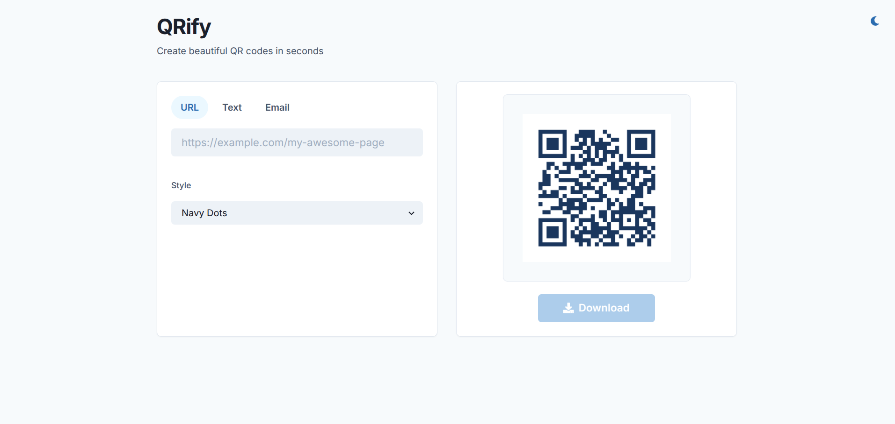

# QR Code Generator

A simple web application built with **React** and **Chakra UI** to generate QR codes easily. This project demonstrates two different deployment strategies: one using **GitHub Actions** (monolithic pipeline) and another using **Jenkins** (CI/CD with Docker and AWS ECS).

## 🚀 Features

- Generate QR codes instantly
- Customize QR code colors
- Download QR codes as images
- Responsive UI with Chakra UI

---

## 📸 Screenshot

<p align="center">
  
</p>

---

## 🌟 Deployment Strategies

This repository contains two branches, each showcasing a different deployment strategy:

### 1. **`monolithic` Branch**

- **Deployment Strategy**: Monolithic CI/CD pipeline using **GitHub Actions**.
- **Pipeline Steps**:
  - **CI**: Build and test the application.
  - **CD**: Deploy to **Amazon S3** and update **Elastic Beanstalk**.
- **Tools Used**:
  - GitHub Actions for CI/CD
  - AWS S3 for static hosting
  - AWS Elastic Beanstalk for deployment

**Branch Purpose**: Ideal for users who prefer a straightforward, GitHub-native CI/CD pipeline.

[View `monolithic` Branch](https://github.com/your-repo/qr-code-generator/tree/monolithic)

---

### 2. **`jenkins-deploy` Branch**

- **Deployment Strategy**: CI/CD pipeline using **Jenkins**.
- **Pipeline Steps**:
  - **CI**: Build and test the application.
  - **CD**: Push the Docker image to **Docker Hub** and update **AWS ECS** (task and service).
- **Tools Used**:
  - Jenkins for CI/CD
  - Docker for containerization
  - Docker Hub for image storage
  - AWS ECS for container orchestration

**Branch Purpose**: Ideal for users who prefer a Jenkins-based CI/CD pipeline with Docker and AWS ECS.

[View `jenkins-deploy` Branch](https://github.com/your-repo/qr-code-generator/tree/jenkins-deploy)

---

## 🛠️ How to Use This Repository

1. **Clone the Repository**:

   ```bash
   git clone https://github.com/your-repo/qr-code-generator.git
   cd qr-code-generator
   ```

2. **Switch to the Desired Branch**:

   - For the **GitHub Actions** deployment strategy:
     ```bash
     git checkout monolithic
     ```
   - For the **Jenkins** deployment strategy:
     ```bash
     git checkout jenkins-deploy
     ```

3. **Install Dependencies**:

   ```bash
   cd frontend
   npm install
   ```

4. **Run the Application Locally**:

   ```bash
   npm start
   ```

5. **Build the Application**:
   ```bash
   npm run build
   ```

---

## 📂 Repository Structure

```
qr-code-generator/
├── frontend/                # Frontend code for the QR Code Generator
│   ├── src/                 # Source files for the application
│   ├── Dockerfile           # Dockerfile for building the frontend image
```

---

## 🤝 Contributing

Contributions are welcome! If you find any issues or have suggestions for improvements, feel free to open an issue or submit a pull request.

---

## 📜 License

This project is licensed under the MIT License. See the [LICENSE](LICENSE) file for details.
