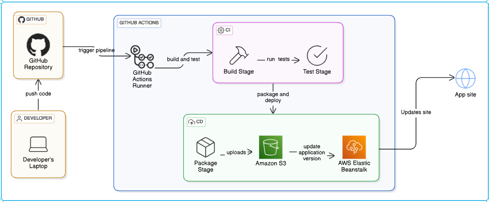

# CI/CD Pipeline with GitHub Actions, S3, and Elastic Beanstalk

## Overview
This project demonstrates a complete CI/CD pipeline using **GitHub Actions** to automate the build, test, and deployment of a web application. The pipeline packages the application, uploads it to **Amazon S3**, and updates the **AWS Elastic Beanstalk** environment to deploy the latest version of the application.

The architecture includes:
1. **GitHub**: Hosts the source code and triggers the pipeline on code commits.
2. **GitHub Actions**: Automates the CI/CD process.
3. **Amazon S3**: Stores the packaged application artifact.
4. **AWS Elastic Beanstalk**: Deploys and manages the application in the cloud.

An architecture diagram is included below for better understanding.

---

## Architecture Diagram

  

---

## Prerequisites

Before setting up the pipeline, ensure the following prerequisites are met:

### 1. AWS Setup
1. **Create an S3 Bucket**:
   - Create an S3 bucket in your AWS account to store the application artifacts.
   - Note the bucket name for use in the pipeline configuration.

2. **Set Up Elastic Beanstalk**:
   - Create an Elastic Beanstalk application and environment.
   - Configure the environment to deploy your application (e.g., platform, instance type).
   - Note the application name and environment name for use in the pipeline.

3. **Create an IAM User**:
   - Create an IAM user with programmatic access (Access Key ID and Secret Access Key).
   - Attach the following policies to the user:
     - `AmazonS3FullAccess`
     - `AWSElasticBeanstalkFullAccess`
   - Securely store the Access Key ID and Secret Access Key for use in the pipeline.

### 2. GitHub Repository
1. Fork or clone this repository to your GitHub account.
2. Add your application code to the repository.

### 3. GitHub Secrets
1. Go to your GitHub repository settings.
2. Navigate to **Secrets and Variables > Actions**.
3. Add the following secrets:
   - `AWS_ACCESS_KEY_ID`: Your AWS Access Key ID.
   - `AWS_SECRET_ACCESS_KEY`: Your AWS Secret Access Key.
   - `S3_BUCKET_NAME`: The name of your S3 bucket.
   - `EB_APPLICATION_NAME`: The name of your Elastic Beanstalk application.
   - `EB_ENVIRONMENT_NAME`: The name of your Elastic Beanstalk environment.

---

## Pipeline Workflow

### 1. CI (Continuous Integration)
The CI pipeline performs the following steps:
- **Build**: Compiles the application code.
- **Test**: Runs unit tests to ensure code quality.
- **Package**: Packages the application into a deployable artifact (e.g., ZIP file).
- **Upload to S3**: Uploads the packaged artifact to the specified S3 bucket.

### 2. CD (Continuous Deployment)
The CD pipeline performs the following steps:
- **Update Elastic Beanstalk**:
  - Fetches the latest artifact from S3.
  - Updates the Elastic Beanstalk environment with the new version of the application.
  - Deploys the application to the cloud.

---

## Configuration

### 1. GitHub Actions Workflow File
The pipeline is defined in `.github/workflows/deploy_to_s3_ebs.yml`. 

---

## How to Use

1. Push your code changes to the `monolithic` branch.
2. The CI pipeline will automatically trigger:
   - Builds and tests the application.
   - Packages and uploads the artifact to S3.
3. If the CI pipeline succeeds, the CD pipeline will trigger:
   - Updates Elastic Beanstalk with the new version.
   - Deploys the application.

---

## Troubleshooting

1. **Pipeline Fails to Trigger**:
   - Ensure the workflow file is located in `.github/workflows/`.
   - Verify that the `monolithic` branch is correctly configured in the workflow.

2. **AWS Permissions Issues**:
   - Double-check the IAM user's permissions.
   - Ensure the secrets (`AWS_ACCESS_KEY_ID`, `AWS_SECRET_ACCESS_KEY`, etc.) are correctly added to GitHub.

3. **Deployment Issues**:
   - Check the Elastic Beanstalk logs for errors.
   - Verify that the S3 bucket and Elastic Beanstalk environment are correctly configured.

---

## Contributing

Contributions are welcome! Please follow these steps:
1. Fork the repository.
2. Create a new branch for your feature or bugfix.
3. Submit a pull request with a detailed description of your changes.

---

## License

This project is licensed under the MIT License. See the [LICENSE](LICENSE) file for details.

